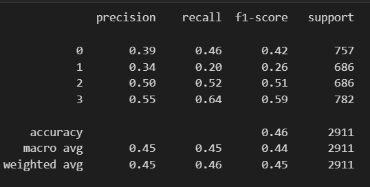

# Developing a Neural Network Classification Model

## AIM

To develop a neural network classification model for the given dataset.

## Problem Statement

An automobile company has plans to enter new markets with their existing products. After intensive market research, they’ve decided that the behavior of the new market is similar to their existing market.

In their existing market, the sales team has classified all customers into 4 segments (A, B, C, D ). Then, they performed segmented outreach and communication for a different segment of customers. This strategy has work exceptionally well for them. They plan to use the same strategy for the new markets.

You are required to help the manager to predict the right group of the new customers.

## Neural Network Model

## DESIGN STEPS

### STEP 1: 
Import the necessary packages.
### STEP 2:
Load and read the dataset.
### STEP 3:
Perform some pre-processing process and cleaning the dataset.
### STEP 4:
Encode categorical values to float/integer for ml purposes.
### STEP 5:
Visualize the data using seaborn and matplotlib.
### STEP 6:
Normalize the value and split and train the dataset.
### STEP 7:
Build the Neural Network model.
### STEP 8:
Compile the model and evaluate the model.
### STEP 9:
Plot the graph for Training Loss, Validation Loss Vs Iteration Plot
### STEP 10:
Predict the new sample data.
## PROGRAM

### Name: YUVARAJ.S
### Register Number: 212222240119

```python
import pandas as pd
import pandas as pd
import numpy as np
from sklearn.model_selection import train_test_split
d=pd.read_csv("customers.csv")
d.head(2)
d.info()
d.isnull().sum()
d_cleaned=d.dropna(axis=0)
d_cleaned.isnull().sum()
d_cleaned['Gender'].unique()
d_cleaned['Ever_Married'].unique()
d_cleaned['Profession'].unique()
d_cleaned['Segmentation'].unique()
from sklearn.preprocessing import OrdinalEncoder
Cat_list=[['Male', 'Female'],['No', 'Yes'],['No', 'Yes'],['Healthcare', 'Engineer', 'Lawyer', 'Artist', 'Doctor',
       'Homemaker', 'Entertainment', 'Marketing', 'Executive'],['Low', 'High', 'Average']]
d1=d_cleaned.copy()
oe=OrdinalEncoder(categories=Cat_list)
d1[['Gender',
             'Ever_Married',
              'Graduated','Profession',
              'Spending_Score']]=oe.fit_transform(d1[['Gender',
                                                    'Ever_Married',
                                                    'Graduated','Profession',
                                                    'Spending_Score']])
d1.info()
from sklearn.preprocessing import LabelEncoder
le = LabelEncoder()
d1['Segmentation']=le.fit_transform(d1['Segmentation'])
d1.info()
import seaborn as sns
corr = d1.corr()
sns.heatmap(corr, 
        xticklabels=corr.columns,
        yticklabels=corr.columns,
        cmap="BuPu",
        annot= True)
sns.pairplot(d1)
sns.distplot(d1['Age'])
import matplotlib.pyplot as plt
plt.figure(figsize=(10,6))
sns.countplot(d1['Family_Size'])
d1.describe()
X=d1[['Gender','Ever_Married','Age','Graduated','Profession','Work_Experience','Spending_Score','Family_Size']].values
y1=d1[['Segmentation']].values
from sklearn.preprocessing import OneHotEncoder
ohe=OneHotEncoder()
ohe.fit(y1)
y=ohe.transform(y).toarray()
X_train,X_test,y_train,y_test=train_test_split(X,y,
                                               test_size=0.33,
                                               random_state=50)
from sklearn.preprocessing import MinMaxScaler
scaler_age = MinMaxScaler()
scaler_age.fit(X_train[:,2].reshape(-1,1))
X_train_scaled = np.copy(X_train)
X_test_scaled = np.copy(X_test)
X_train_scaled[:,2] = scaler_age.transform(X_train[:,2].reshape(-1,1)).reshape(-1)
X_test_scaled[:,2] = scaler_age.transform(X_test[:,2].reshape(-1,1)).reshape(-1)
import tensorflow as tf
from tensorflow.keras.models import Sequential
from tensorflow.keras.layers import Dense
model = Sequential([
    Dense(4, input_shape=(8,), activation='relu'),
    Dense(8, activation='relu'),
    Dense(8, activation='relu'),
    Dense(4,activation='softmax')
])
model.compile(
    optimizer='adam',
    loss='categorical_crossentropy',
    metrics=['accuracy']
)
from tensorflow.keras.callbacks import EarlyStopping
early_stop = EarlyStopping(monitor='val_loss', patience=2)
model.fit(
    X_train_scaled,  
    y_train,         
    epochs=800,       
    batch_size=128,   
    validation_data=(X_test_scaled, y_test),
)
metrics = pd.DataFrame(model.history.history)
metrics.head()
metrics[['loss','val_loss']].plot()
x_test_predictions = np.argmax(model.predict(X_test_scaled), axis=1)
x_test_predictions.shape
y_test_truevalue = np.argmax(y_test,axis=1)
from sklearn.metrics import classification_report,confusion_matrix
print(confusion_matrix(y_test_truevalue,x_test_predictions))
print(classification_report(y_test_truevalue,x_test_predictions))
x_single_prediction = np.argmax(model.predict(X_test_scaled[1:2,:]), axis=1)
print(x_single_prediction)
print(le.inverse_transform(x_single_prediction))
```
## OUTPUT
### Dataset Information


### Training Loss, Validation Loss Vs Iteration Plot

### Classification Report


### Confusion Matrix


### New Sample Data Prediction


## RESULT
A neural network model is developed successfully for the given dataset.
